# Pipeline Processing Flow Diagrams

## Overview

This document provides comprehensive Mermaid diagrams that describe all processing steps in the SE Letters pipeline architecture. The diagrams cover all three production pipeline versions and their respective processing flows.

**Current Pipeline Versions:**
- **Webapp Integration Pipeline v2.1.0** - Production webapp integration
- **SOTA Pipeline v2.0.0** - State-of-the-art AI processing
- **Enhanced Semantic Pipeline v1.1.0** - Multi-dimensional semantic extraction

## 1. Overall Pipeline Architecture

```mermaid
graph TB
    subgraph "Input Layer"
        A[📄 Obsolescence Letters<br/>PDF/DOCX/DOC] --> B[📁 Document Storage<br/>data/input/letters/]
    end
    
    subgraph "Processing Layer"
        B --> C{🔀 Pipeline Selection}
        
        C -->|Webapp Integration| D[🚀 Webapp Pipeline v2.1.0<br/>Real-time Processing]
        C -->|SOTA Processing| E[🧠 SOTA Pipeline v2.0.0<br/>Advanced AI]
        C -->|Semantic Analysis| F[🔍 Semantic Pipeline v1.1.0<br/>Multi-dimensional]
    end
    
    subgraph "Data Layer"
        G[🗄️ IBcatalogue Database<br/>342,229 Products]
        H[📊 Letters Database<br/>Processing History]
        I[🔄 Staging Database<br/>JSON Storage]
    end
    
    subgraph "Output Layer"
        D --> J[📱 Webapp JSON<br/>Real-time Response]
        E --> K[📊 SOTA Results<br/>Hierarchical Matching]
        F --> L[📋 HTML Reports<br/>Comprehensive Analysis]
    end
    
    subgraph "Services Layer"
        M[🤖 xAI Grok Service<br/>AI Extraction]
        N[🔍 DuckDB Service<br/>Product Database]
        O[🖼️ Image Processor<br/>OCR & Analysis]
        P[📝 Document Processor<br/>Multi-format Support]
    end
    
    D -.-> M
    D -.-> N
    E -.-> M
    E -.-> N
    E -.-> O
    E -.-> I
    F -.-> N
    F -.-> P
    
    style A fill:#e1f5fe
    style J fill:#c8e6c9
    style K fill:#c8e6c9
    style L fill:#c8e6c9
    style M fill:#fff3e0
    style N fill:#fff3e0
    style O fill:#fff3e0
    style P fill:#fff3e0
```

## 2. Webapp Integration Pipeline v2.1.0

```mermaid
flowchart TD
    A[📄 Document Input<br/>PDF/DOCX/DOC] --> B[🔍 Context Analysis<br/>Voltage Level & Category]
    
    B --> C[🤖 SOTA Grok Direct Processing<br/>Raw Document Analysis]
    
    C --> D[📊 Metadata Extraction<br/>Product Ranges, Codes, Confidence]
    
    D --> E[💾 Letter Database Storage<br/>Store Processing History]
    
    E --> F[✅ Range Validation<br/>Against IBcatalogue Database]
    
    F --> G{🔍 Valid Ranges?}
    
    G -->|Yes| H[🔍 Product Search<br/>Find Obsolete Products]
    G -->|No| I[❌ No Products Found<br/>Return Empty Results]
    
    H --> J[🔄 Replacement Search<br/>Find Modernization Paths]
    
    J --> K[📊 Result Compilation<br/>Performance Metrics]
    
    K --> L[📱 JSON Output<br/>Webapp-Compatible Format]
    
    subgraph "Database Operations"
        M[🗄️ IBcatalogue.duckdb<br/>342,229 Products]
        N[📊 letters.duckdb<br/>Processing History]
    end
    
    F -.-> M
    E -.-> N
    
    subgraph "Performance Metrics"
        O[⏱️ Processing Time<br/>Real-time Monitoring]
        P[🎯 Confidence Scoring<br/>Extraction Quality]
        Q[📉 Search Space Reduction<br/>Efficiency Metrics]
    end
    
    K -.-> O
    K -.-> P
    K -.-> Q
    
    style A fill:#e3f2fd
    style L fill:#c8e6c9
    style M fill:#fff3e0
    style N fill:#fff3e0
```

## 3. SOTA Pipeline v2.0.0 - Advanced Architecture

```mermaid
flowchart TD
    A[📄 Document Input<br/>PDF/DOCX/DOC] --> B[📝 Document Processing<br/>Text Extraction]
    
    B --> C[🖼️ Enhanced Image OCR<br/>Embedded Image Analysis]
    
    C --> D[📄 Content Combination<br/>Text + Image OCR]
    
    D --> E[🧠 SOTA Grok Structured Extraction<br/>AI-Powered Analysis]
    
    E --> F[📊 Structured Product Data<br/>Product Line Classification]
    
    F --> G[📥 JSON Staging Injection<br/>Intermediate Storage]
    
    G --> H[🔍 Hierarchical Product Matching<br/>4-Level Search Strategy]
    
    H --> I[📊 Hierarchical Match Results<br/>Confidence Scoring]
    
    I --> J[📋 SOTA Processing Result<br/>Comprehensive Output]
    
    subgraph "Hierarchical Matching Levels"
        K[🏭 Product Line<br/>PPIBS/PSIBS/DPIBS/SPIBS]
        L[📦 Product Range<br/>Masterpact/TeSys/etc.]
        M[🔧 Product Subrange<br/>NSX100/ATV900/etc.]
        N[⚡ Individual Product<br/>Specific Product Codes]
    end
    
    H --> K
    K --> L
    L --> M
    M --> N
    
    subgraph "Staging Database"
        O[📊 Staging Tables<br/>JSON Data Storage]
        P[🔄 Audit Trail<br/>Processing History]
    end
    
    G -.-> O
    G -.-> P
    
    subgraph "Performance Metrics"
        Q[⏱️ Processing Time<br/>Async Performance]
        R[🎯 Extraction Confidence<br/>AI Quality Score]
        S[🔍 Matching Confidence<br/>Hierarchical Accuracy]
        T[📦 Products Found<br/>Total Matches]
    end
    
    J -.-> Q
    J -.-> R
    J -.-> S
    J -.-> T
    
    style A fill:#e3f2fd
    style J fill:#c8e6c9
    style K fill:#fff3e0
    style L fill:#fff3e0
    style M fill:#fff3e0
    style N fill:#fff3e0
```

## 4. Enhanced Semantic Pipeline v1.1.0 - Multi-dimensional Analysis

```mermaid
flowchart TD
    A[📄 Document Input<br/>PDF/DOCX/DOC] --> B[🧠 Context Analysis<br/>Voltage & Category Detection]
    
    B --> C[📝 Document Processing<br/>Text Extraction]
    
    C --> D[🔍 Enhanced Semantic Extraction<br/>6-Dimensional Analysis]
    
    D --> E[📊 Multi-dimensional Data<br/>Ranges, Subranges, Device Types]
    
    E --> F{🔧 Enhanced Mode?}
    
    F -->|Yes| G[🔍 Multi-dimensional Search<br/>Advanced Search Criteria]
    F -->|No| H[✅ Range Validation<br/>Traditional Validation]
    
    G --> I[📉 Search Space Refinement<br/>Up to 99.6% Reduction]
    H --> J[🔍 Product Search<br/>Obsolete & Replacement]
    
    I --> K[📊 Enhanced Search Results<br/>Optimized Product Matching]
    J --> L[📊 Traditional Search Results<br/>Validated Product Lists]
    
    K --> M[📋 Enhanced Processing Result<br/>Multi-dimensional Output]
    L --> M
    
    M --> N[📄 HTML Report Generation<br/>Comprehensive Analysis]
    
    subgraph "6-Dimensional Extraction"
        O[📦 Product Ranges<br/>Masterpact, TeSys, etc.]
        P[🔧 Product Subranges<br/>NSX100, ATV900, etc.]
        Q[⚙️ Device Types<br/>Circuit Breakers, Contactors]
        R[🏷️ Brands<br/>Schneider Electric]
        S[📐 Technical Specs<br/>Voltage, Current, etc.]
        T[🏭 PL Services<br/>PPIBS, PSIBS, etc.]
    end
    
    D --> O
    D --> P
    D --> Q
    D --> R
    D --> S
    D --> T
    
    subgraph "Search Strategies"
        U[🔍 Multi-dimensional Search<br/>6D Criteria Matching]
        V[📉 Search Space Optimization<br/>Intelligent Filtering]
        W[🎯 Confidence Scoring<br/>Multi-level Validation]
    end
    
    G -.-> U
    G -.-> V
    G -.-> W
    
    subgraph "Performance Metrics"
        X[⏱️ Processing Time<br/>Multi-dimensional Analysis]
        Y[📉 Search Space Reduction<br/>Efficiency Metrics]
        Z[🎯 Extraction Confidence<br/>AI Quality Assessment]
        AA[📊 Products Found<br/>Obsolete & Replacement Counts]
    end
    
    M -.-> X
    M -.-> Y
    M -.-> Z
    M -.-> AA
    
    style A fill:#e3f2fd
    style N fill:#c8e6c9
    style O fill:#fff3e0
    style P fill:#fff3e0
    style Q fill:#fff3e0
    style R fill:#fff3e0
    style S fill:#fff3e0
    style T fill:#fff3e0
```

## 5. Service Integration Architecture

```mermaid
graph TB
    subgraph "Core Services"
        A[🤖 xAI Grok Service<br/>v2.1.0<br/>AI-Powered Extraction]
        B[🗄️ DuckDB Service<br/>v2.1.0<br/>Product Database]
        C[📝 Document Processor<br/>v2.1.0<br/>Multi-format Support]
        D[🖼️ Image Processor<br/>v2.0.0<br/>OCR & Analysis]
        E[📊 Staging Service<br/>v2.0.0<br/>JSON Storage]
        F[🔍 Semantic Engine<br/>v1.1.0<br/>Multi-dimensional Analysis]
    end
    
    subgraph "Pipeline Orchestrators"
        G[🚀 Webapp Pipeline<br/>v2.1.0<br/>Real-time Processing]
        H[🧠 SOTA Pipeline<br/>v2.0.0<br/>Advanced AI]
        I[🔍 Semantic Pipeline<br/>v1.1.0<br/>Multi-dimensional]
    end
    
    subgraph "Data Sources"
        J[📁 IBcatalogue.duckdb<br/>342,229 Products]
        K[📊 letters.duckdb<br/>Processing History]
        L[🔄 staging.duckdb<br/>JSON Storage]
        M[📄 Input Documents<br/>PDF/DOCX/DOC]
    end
    
    subgraph "Output Formats"
        N[📱 Webapp JSON<br/>Real-time Response]
        O[📊 SOTA Results<br/>Hierarchical Data]
        P[📋 HTML Reports<br/>Comprehensive Analysis]
    end
    
    G --> A
    G --> B
    G --> C
    
    H --> A
    H --> B
    H --> C
    H --> D
    H --> E
    
    I --> B
    I --> C
    I --> F
    
    A -.-> J
    B -.-> J
    B -.-> K
    E -.-> L
    C -.-> M
    
    G --> N
    H --> O
    I --> P
    
    style A fill:#e8f5e8
    style B fill:#e8f5e8
    style C fill:#e8f5e8
    style D fill:#e8f5e8
    style E fill:#e8f5e8
    style F fill:#e8f5e8
    style G fill:#fff3e0
    style H fill:#fff3e0
    style I fill:#fff3e0
    style N fill:#c8e6c9
    style O fill:#c8e6c9
    style P fill:#c8e6c9
```

## 6. Data Flow Architecture

```mermaid
flowchart LR
    subgraph "Input Sources"
        A[📄 Obsolescence Letters<br/>PDF/DOCX/DOC Files]
        B[🗄️ IBcatalogue Database<br/>342,229 Product Records]
        C[⚙️ Configuration<br/>YAML Config Files]
    end
    
    subgraph "Processing Engines"
        D[🚀 Webapp Engine<br/>v2.1.0<br/>Real-time Processing]
        E[🧠 SOTA Engine<br/>v2.0.0<br/>AI-Powered Analysis]
        F[🔍 Semantic Engine<br/>v1.1.0<br/>Multi-dimensional Search]
    end
    
    subgraph "Data Processing"
        G[📊 Metadata Extraction<br/>Product Information]
        H[🔍 Product Matching<br/>Database Queries]
        I[📈 Performance Metrics<br/>Processing Statistics]
        J[💾 Data Storage<br/>Results & History]
    end
    
    subgraph "Output Destinations"
        K[📱 Webapp Interface<br/>Real-time JSON API]
        L[📋 HTML Reports<br/>Comprehensive Analysis]
        M[📊 Database Storage<br/>Processing History]
        N[📈 Performance Logs<br/>Monitoring Data]
    end
    
    A --> D
    A --> E
    A --> F
    
    B --> H
    C --> D
    C --> E
    C --> F
    
    D --> G
    D --> H
    D --> I
    D --> J
    
    E --> G
    E --> H
    E --> I
    E --> J
    
    F --> G
    F --> H
    F --> I
    F --> J
    
    G --> K
    G --> L
    H --> K
    H --> L
    I --> N
    J --> M
    
    style A fill:#e3f2fd
    style B fill:#e3f2fd
    style C fill:#e3f2fd
    style K fill:#c8e6c9
    style L fill:#c8e6c9
    style M fill:#c8e6c9
    style N fill:#c8e6c9
```

## 7. Error Handling & Fallback Architecture

```mermaid
flowchart TD
    A[📄 Document Input] --> B{🔍 Document Valid?}
    
    B -->|No| C[❌ Invalid Document<br/>Return Error Response]
    B -->|Yes| D[📝 Document Processing]
    
    D --> E{📝 Processing Success?}
    
    E -->|No| F[🔄 Fallback Processing<br/>Mock Services]
    E -->|Yes| G[🤖 AI Extraction]
    
    F --> H[📊 Mock Results<br/>Test Data]
    G --> I{🤖 AI Extraction Success?}
    
    I -->|No| J[🔄 Fallback AI<br/>Basic Extraction]
    I -->|Yes| K[🔍 Database Search]
    
    J --> L[📊 Basic Results<br/>Limited Data]
    K --> M{🔍 Database Available?}
    
    M -->|No| N[🔄 Fallback Database<br/>Mock Products]
    M -->|Yes| O[📊 Product Matching]
    
    N --> P[📊 Mock Products<br/>Test Data]
    O --> Q{📊 Products Found?}
    
    Q -->|No| R[📊 Empty Results<br/>No Matches]
    Q -->|Yes| S[📋 Final Results<br/>Complete Data]
    
    H --> T[📱 Output Response<br/>Error Handling]
    L --> T
    P --> T
    R --> T
    S --> T
    
    subgraph "Error Recovery"
        U[🔄 Retry Logic<br/>Exponential Backoff]
        V[📊 Graceful Degradation<br/>Partial Results]
        W[📝 Error Logging<br/>Debug Information]
    end
    
    C -.-> W
    F -.-> V
    J -.-> V
    N -.-> V
    R -.-> V
    
    style A fill:#e3f2fd
    style T fill:#c8e6c9
    style C fill:#ffcdd2
    style U fill:#fff3e0
    style V fill:#fff3e0
    style W fill:#fff3e0
```

## 8. Performance Monitoring Architecture

```mermaid
flowchart TD
    A[📄 Document Processing] --> B[⏱️ Start Timer]
    
    B --> C[📝 Document Processing<br/>Text Extraction]
    C --> D[⏱️ Document Time]
    
    D --> E[🤖 AI Extraction<br/>Metadata Analysis]
    E --> F[⏱️ AI Time]
    
    F --> G[🔍 Database Search<br/>Product Matching]
    G --> H[⏱️ Database Time]
    
    H --> I[📊 Result Compilation<br/>Performance Metrics]
    I --> J[⏱️ Total Time]
    
    J --> K[📈 Performance Report<br/>Processing Statistics]
    
    subgraph "Performance Metrics"
        L[⏱️ Processing Time<br/>Total Duration]
        M[🎯 Confidence Scores<br/>Extraction Quality]
        N[📉 Search Efficiency<br/>Space Reduction]
        O[📊 Product Counts<br/>Matches Found]
        P[💾 Memory Usage<br/>Resource Consumption]
    end
    
    K --> L
    K --> M
    K --> N
    K --> O
    K --> P
    
    subgraph "Monitoring Dashboard"
        Q[📊 Real-time Metrics<br/>Live Performance]
        R[📈 Historical Data<br/>Trend Analysis]
        S[⚠️ Performance Alerts<br/>Threshold Monitoring]
    end
    
    L -.-> Q
    M -.-> Q
    N -.-> Q
    O -.-> Q
    P -.-> Q
    
    Q -.-> R
    Q -.-> S
    
    style A fill:#e3f2fd
    style K fill:#c8e6c9
    style Q fill:#fff3e0
    style R fill:#fff3e0
    style S fill:#fff3e0
```

## Pipeline Version Comparison

| Feature | Webapp v2.1.0 | SOTA v2.0.0 | Semantic v1.1.0 |
|---------|---------------|-------------|------------------|
| **Processing Speed** | Real-time | Async | Batch |
| **AI Integration** | Direct Grok | Structured Grok | Enhanced Semantic |
| **Database** | DuckDB | DuckDB + Staging | DuckDB |
| **Output Format** | JSON | JSON | HTML |
| **Architecture** | Linear | Hierarchical | Multi-dimensional |
| **Use Case** | Webapp Integration | Advanced AI | Comprehensive Analysis |

## Key Processing Steps Summary

### 1. Document Input & Validation
- **File Format Support**: PDF, DOCX, DOC
- **Validation**: File existence, format compatibility
- **Context Analysis**: Voltage levels, product categories

### 2. Text Extraction & Processing
- **Document Processing**: Multi-format text extraction
- **Image OCR**: Embedded image analysis (SOTA pipeline)
- **Content Combination**: Text + image content

### 3. AI-Powered Analysis
- **xAI Grok Service**: AI-powered metadata extraction
- **Structured Data**: Product information, ranges, codes
- **Confidence Scoring**: Quality assessment

### 4. Database Operations
- **Product Matching**: IBcatalogue database queries
- **Range Validation**: Valid vs invalid range filtering
- **Staging Storage**: Intermediate data storage (SOTA)

### 5. Result Compilation
- **Performance Metrics**: Processing time, confidence scores
- **Product Lists**: Obsolete and replacement products
- **Output Formatting**: JSON, HTML, or structured data

### 6. Error Handling & Fallback
- **Graceful Degradation**: Fallback to mock services
- **Error Recovery**: Retry logic and exponential backoff
- **Comprehensive Logging**: Debug information and monitoring

---

**Document Version**: 1.0.0
**Pipeline Versions**: v2.1.0, v2.0.0, v1.1.0
**Last Updated**: 2024-01-15
**Architecture**: Multi-pipeline, Service-oriented, AI-powered 